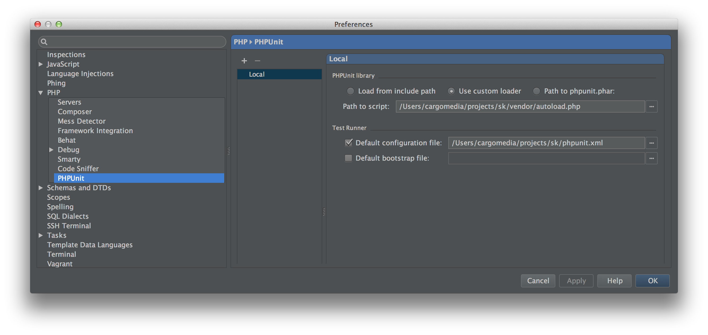

Tools
=====

Online Schema Change
--------------------
Change table-schemas without locking the table with [Percona's](http://www.percona.com/) pt-online-schema-change

**Usage**

```shell
pt-online-schema-change --execute --critical-load="Threads_running:500" --max-load "Threads_running:250" --charset=utf8 --user=root --ask-pass --database=[database] t=[table] --alter='ADD `userId` int(10) unsigned NOT NULL DEFAULT '0', ADD `createStamp` int(10) unsigned NOT NULL DEFAULT '0', ADD KEY `createStamp` (`createStamp`), ADD KEY `userId` (`userId`)'
```

**Download**

[Percona Toolkit for MySQL](http://www.percona.com/software/percona-toolkit)

**Full Documentation**

http://www.percona.com/doc/percona-toolkit/2.2/pt-online-schema-change.html

**IMPORTANT**

Read the full [documentation](http://www.percona.com/doc/percona-toolkit/2.2/pt-online-schema-change.html) before using it, there a lot of peculiarities that need to be considered before using this tool.


SSH
---
**Create key**

```bash
ssh-keygen -t rsa -f ~/.ssh/id_rsa -P ''
```

**Copy public key to remote machine**

```bash
ssh-copy-id root@<REMOTE_HOST>
```

**Initiate port forwarding**

```bash
ssh -NL *:8086:<REMOTE_HOST>:8086 root@<REMOTE_HOST>
```

**Forward remote port to local**

```bash
ssh -NR *:1234:localhost:80 root@<REMOTE_HOST>
```
(`GatewayPorts yes` in `sshd_config` required to bind to non-loopback interface)


Git
---
**Deleting branch on github**

```bash
git push origin --delete <branchName>
```


OpenSSL
-------
**Convert PFX to key+pem**

```
openssl pkcs12 -in input.pfx -nocerts -nodes -out output.key
openssl pkcs12 -in input.pfx -clcerts -nokeys -out output.pem
```

**Create key+csr**

```
openssl req -new -newkey rsa:2048 -nodes -keyout *.cargomedia.ch.key -out *.cargomedia.ch.csr -subj '/CN=*.cargomedia.ch/C=CH'
```

**Create key+pem**
```
openssl req -x509 -nodes -days 3650 -newkey rsa:2048 -keyout *.cargomedia.ch.key -out *.cargomedia.ch.pem -subj '/CN=*.cargomedia.ch'
```

**Output hash of certificate (used by apache for chain following)**
```
openssl x509 -noout -hash -in input.pem
```


ffmpeg
------
**Convert `MTS` to `mp4`**
```
cp /Volumes/NO\ NAME/PRIVATE/AVCHD/BDMV/STREAM/* .
rm -rf /Volumes/NO\ NAME/PRIVATE/AVCHD
ffmpeg -i concat:"00001.MTS|00004.MTS|00005.MTS" -vcodec copy -acodec copy result.mp4
```

Restoring a backup
------------------
**Shared files folder**

This script restores the latest backup from `rdiff-backup` on the backup server to the storage server. Storage server needs to be publicly listening to the Internet via port 22
```sh
HOST="1.2.3.4"

echo "Restoring latest backup..."
rm -rf /tmp/restore-shared
rdiff-backup --restore-as-of now /home/backup/shared /tmp/restore-shared

echo "Copying to $HOST..."
scp -pr -C -o CompressionLevel=9 /tmp/restore-shared root@$HOST:/raid/shared
rm -rf /tmp/restore-shared
```

**Restoring the database files**

This script gives only the big picture, it's not suitable to be run without modifying it
```sh
HOST="<IP ADDRESS OF DATABASE SERVER>"

echo "Restoring latest backup..."
rm -rf /tmp/restore-db
rdiff-backup --restore-as-of now /home/backup/db /tmp/restore-db

echo "Copying to $HOST..."
scp -pr -C -o CompressionLevel=9 /tmp/restore-db root@$HOST:/var/lib/mysql
rm -rf /tmp/restore-db
```

PhpStorm
--------
**PHPUnit Test Runner**

Go to `Preferences > PHP > PHPUnit` and under `Test runner` check the checkbox next to `Default configuration file` and select the `phpunit.xml`
inside the root folder of the project you're setting up.

**Vagrant PhpStorm Tunnel**

To run PHPUnit tests using PHP (installed in the Vagrant virtual machine) via ssh install
[vagrant-phpstorm-tunnel](https://github.com/cargomedia/vagrant-phpstorm-tunnel) and follow the instructions to set it up.

** PHPUnit 4 incompatibility

Instead of relying on the default `include-path` setting, use the `custom loader` option and specify the path to composer's autoload.php.


